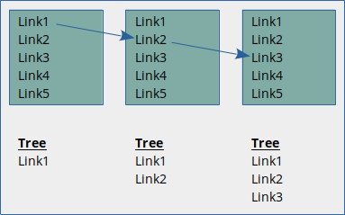
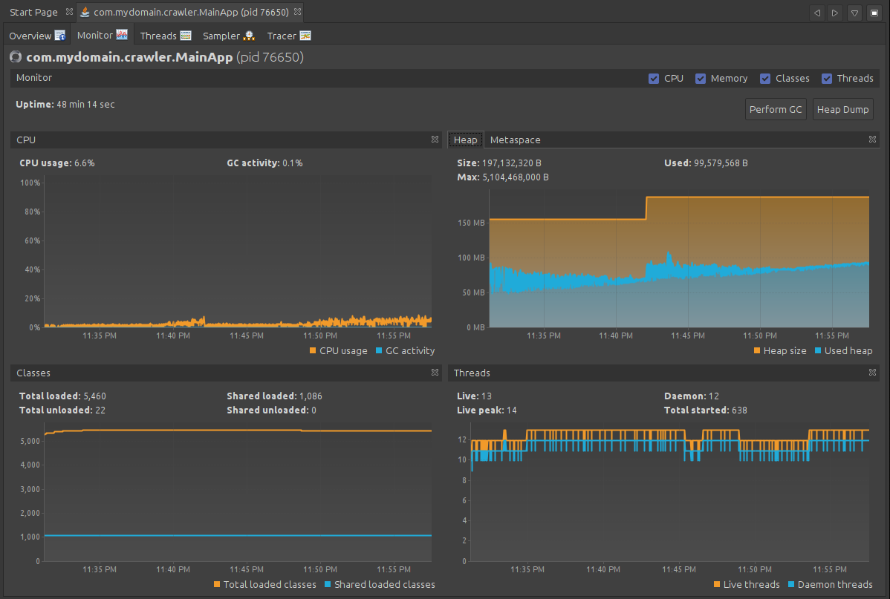
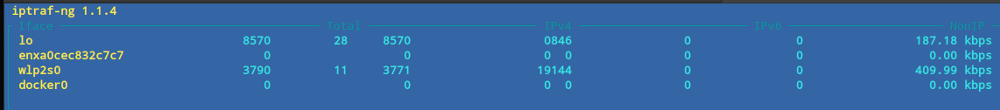
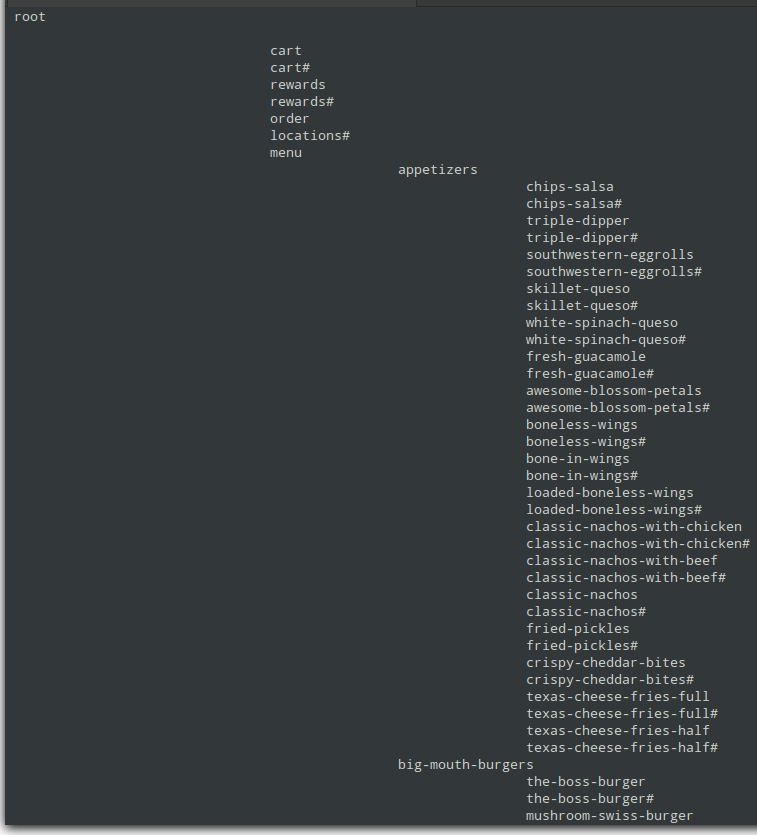
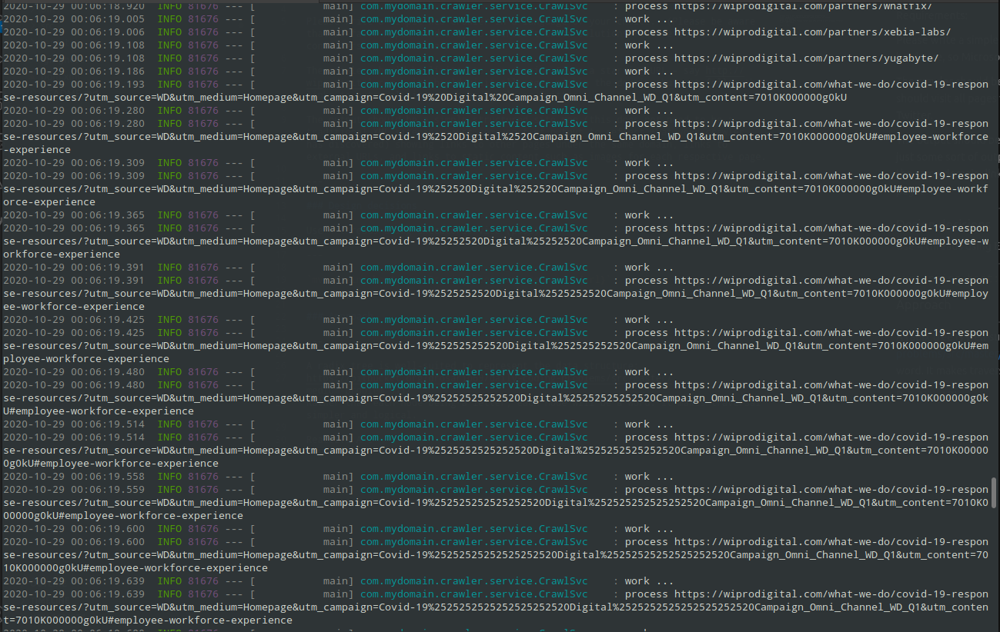

# web-crawler

## Requirements:

Please write a simple web crawler in a language of your choice.  (Please be aware that we favor Apple hardware, so Microsoft based solutions require the use of containers or virtual machines).

The crawler should be limited to one domain. Given a starting URL – say http://wiprodigital.com - it should visit all pages within the domain, but not follow the links to external sites such as Google or Twitter.

The output should be a simple structured site map (this does not need to be a traditional XML sitemap - just some sort of output to reflect what your crawler has discovered) showing links to other pages under the same domain, links to external URLs, and links to static content such as images for each respective page.

---

## Design considerations/decisions

### Data structure representation and traversal

The URL's which are discovered can be stored in a simple List. A HashSet would guarantee uniqueness, but the library is not thread-safe and needs to wrapped by Collections.synchronizedSet().

A better representation of the URL's is a Radix Tree:
https://bitbucket.org/drosario69/daily-coding-problems/src/master/medium-problem_011/. This is ideal for display purposes since the traversal is intuitive with regards to hierarchical data.

In order to "visit" each page via the crawler, one must accumulate all the `<a href="">` DOM elements. As with any graph, one can choose depth-first traversal or breadth-first traversal. This solution employs depth-first, which presents a problem. Consider the following:

Web pages are commonly rendered using some type of template, where each page has a consistent menu. With depth-first traversal, we discover link1, which we follow to a second page, and that page contains the same 5 links as the previous page. We notice that we already visited link1 and visit link2 instead, rendering the 3rd page. We continue this until we reach link5 on the 5th page. Since we use recursion for traversal, we have placed some information onto the stack, and if we have a site with many links, all of which persist across every page, we can actually exceed our stack capacity.

A better solution (not implemented) would be breadth-first traversal. We visit page1, find and record all of the links before visiting any of them, and when we recurse to page2, we will detect that all 5 links were already visited, and we can mitigate the stack overflow.

In the Radix Tree, external links are stored at the top-level node. They can exist on multiple pages, and making them "belong" to any particular page doesn't quite make sense.

### Performance

When run as a single-threaded application, obtaining results requires an exhobitantly long amout of time. The idea was to use multiple threads via the ExecutorService. The problem with depth-first recursion is that it is not difficult to exhaust all threads since each deeper level uses a thread.

Using `visualvm` (via JMX), we can see that the application is not CPU-bound:

The application is I/O bound and spends most of its time retrieving web pages. Since it is currently single-threaded, it does not run the risk of saturating the network.

This might be an important factor for multi-tenant environments, where "noisy neighbors" can impact other applications.

---

## Sample output

The following is output using `https://www.chilis.com`:

An inexplicable condition is encountered when using `https://wiprodigital.com`:

The application uses the jSoup library to retrieve and parse pages rather than low-level HTTPConnection calls.

---

## Running the solution

The application uses Spring Boot and can be run two ways: via maven or via a packaged .jar file:

`mvn spring-boot:run -Dspring-boot.run.arguments={url}`

or

`java -jar crawler-1.0.0.jar {url}`
